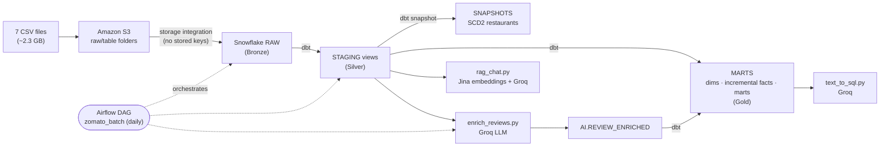

# Food Flows

End-to-end Batch data platform processing 10M orders, ~23M order items, 300K reviews: **Amazon S3 → Snowflake → dbt → Airflow**, with an LLM layer (Groq + Jina) for review enrichment, RAG over customer reviews, and text-to-SQL over the warehouse.

## Architecture



## What gets built

| Layer | Where | What |
|---|---|---|
| **Source** | `data/` (local, not committed) | 4 dimension CSVs (restaurants ~148K, users 100K, food, menu) + 3 fact files: **10M orders**, **~23M order items**, **300K free-text reviews** |
| **Lake** | Amazon S3 | One bucket, one `raw/<table>/` folder per CSV |
| **Bronze** | Snowflake `ZOMATO.RAW` | `COPY INTO` from S3 through a keyless storage integration |
| **Silver** | Snowflake `ZOMATO.STAGING` | dbt views: clean, type and rename every source |
| **Gold** | Snowflake `ZOMATO.MARTS` | Dimensions, **incremental** facts (MERGE) and business marts |
| **History** | Snowflake `ZOMATO.SNAPSHOTS` | **SCD2** snapshot of restaurants |
| **AI** | Snowflake `ZOMATO.AI` | LLM-enriched reviews (sentiment, topic, key issue) |
| **Orchestration** | Airflow 3 (Docker) | One daily DAG: load → transform → enrich → AI mart |

## Tech stack

Python · Pandas · Amazon S3 · AWS IAM · Snowflake · dbt (dbt-snowflake) · Apache Airflow 3 (Docker) · Groq (`openai/gpt-oss-120b`) · Jina AI embeddings · Streamlit

## Repository structure

```
├── airflow/
│   ├── Dockerfile               # Airflow 3 + Snowflake provider + Groq, dbt in its own venv
│   ├── docker-compose.yml       # postgres + api-server + scheduler + dag-processor
│   ├── .env.example             # template for airflow/.env
│   └── dags/zomato_batch.py     # the pipeline DAG (4 tasks)
├── zomato/                      # dbt project
│   ├── profiles.example.yml     # template for profiles.yml (credentials via env_var)
│   ├── models/staging/          # 7 staging views + sources + tests
│   ├── models/marts/            # dims, incremental facts, business marts + tests
│   ├── snapshots/               # SCD2 snapshot of restaurants
│   └── macros/                  # custom schema-name macro
├── ai/
│   ├── enrich_reviews.py        # LLM enrichment → ZOMATO.AI.REVIEW_ENRICHED
│   ├── rag_chat.py              # "chat with your reviews" (Streamlit)
│   ├── text_to_sql.py           # "chat with your warehouse" (Streamlit)
│   └── .env.example             # template for ai/.env
├── snowflake/                   # setup SQL, run in order in Snowsight
│   ├── 01_setup.sql             # warehouse, database, schemas, DBT_ROLE
│   ├── 02_storage_integration.sql
│   ├── 03_stage_and_formats.sql
│   ├── 04_raw_tables.sql
│   └── 05_copy_into.sql
├── aws/iam/                     # IAM policy + trust policies for the S3 ↔ Snowflake link
└── requirements.txt             # Python dependencies (dbt + AI apps)
```

## How the pipeline works

### 1. Load: S3 → Snowflake

The seven CSVs are uploaded to `s3://<BUCKET>/raw/<table>/`. Snowflake reads the bucket through a **storage integration** and an IAM role, so no AWS keys are stored in Snowflake ([`snowflake/02_storage_integration.sql`](snowflake/02_storage_integration.sql), [`aws/iam/`](aws/iam/)). `COPY INTO` loads each folder into `ZOMATO.RAW`: dimension files tolerate bad rows (`ON_ERROR='CONTINUE'`), fact files fail fast so counts stay exact.

### 2. Transform: dbt

- **Staging:** one view per source. Parses the messy restaurant data (`--` → null, `₹ 200` → 200, `50+` → 50), normalises types and names, derives `is_delivered`.
- **Dimensions:** `dim_restaurants`, `dim_customer` (with age segments), `dim_food`, and a generated `dim_date` calendar.
- **Incremental facts:** `fct_orders` and `fct_order_items` use `materialized='incremental'` with a MERGE strategy, so a re-run only processes new rows instead of rebuilding 10M+.
- **Marts:** one table per business question: daily city revenue (GMV, AOV, cancel rate), restaurant performance, delivery SLA (p50/p90 by city and hour), review insights.
- **SCD2 snapshot:** `restaurants_snapshot` keeps the history of rating, price and cuisine changes (`strategy='check'`, since the source has no `updated_at` column).
- **Tests:** `unique`, `not_null`, `relationships` and `accepted_values`; `dbt build` runs models, snapshots and tests in dependency order.

### 3. Orchestrate: Airflow

One daily DAG, [`zomato_batch`](airflow/dags/zomato_batch.py):

```
reload_raw  →  dbt_build_core  →  enrich_reviews  →  dbt_build_ai
(COPY from S3)  (dbt build + tests)  (LLM enrichment)    (AI mart)
```

Credentials are injected by docker-compose from `airflow/.env`; nothing secret is stored in the code.

### 4. AI layer

1. **LLM enrichment** ([`ai/enrich_reviews.py`](ai/enrich_reviews.py)): the LLM as a transformation step. Reads reviews from `STG_REVIEWS`, asks the model for structured JSON (sentiment label and score, topic, key issue) and writes it to `ZOMATO.AI.REVIEW_ENRICHED`, which dbt models into `mart_review_insights`. Idempotent (already-enriched reviews are skipped) and capped by `SAMPLE_N` per run to bound cost.
2. **RAG** ([`ai/rag_chat.py`](ai/rag_chat.py)): embeds a sample of 500 reviews with Jina, retrieves the 5 most similar to a question by cosine similarity, and answers with Groq using only those reviews, showing them as sources.
3. **Text-to-SQL** ([`ai/text_to_sql.py`](ai/text_to_sql.py)): the LLM receives the marts' schema and join keys, writes one Snowflake `SELECT`, and a keyword guard checks it before it runs.

## Getting started

### Prerequisites

- Snowflake account, AWS account with an S3 bucket
- Docker (for Airflow), Python 3
- Groq and Jina API keys
- The dataset CSVs placed in `data/` (not committed, ~2.3 GB)

### 1. Snowflake and AWS

Run `snowflake/01_setup.sql` → `05_copy_into.sql` in order in Snowsight, using the JSON files in `aws/iam/` for the IAM policy and role. The order matters for the storage integration: create the IAM role → create the integration → `DESC INTEGRATION` → paste the Snowflake IAM user ARN and external ID into the role's trust policy. Do not re-run `CREATE OR REPLACE` on the integration afterwards: it regenerates the external ID and breaks the trust.

### 2. Python environment

```bash
python -m venv .venv && source .venv/bin/activate
pip install -r requirements.txt
```

### 3. dbt

```bash
cd zomato
cp profiles.example.yml profiles.yml        # credentials are read from env vars
export SNOWFLAKE_ACCOUNT=... SNOWFLAKE_USER=... SNOWFLAKE_PASSWORD=...
dbt debug
dbt build --exclude tag:ai
```

### 4. Airflow

```bash
cd airflow
cp .env.example .env                        # fill SNOWFLAKE_*, GROQ_API_KEY, SAMPLE_N
docker compose build && docker compose up -d
# http://localhost:8080 (admin/admin) → un-pause zomato_batch → Trigger
```

The containers mount `zomato/`, so `zomato/profiles.yml` from step 3 must exist.

### 5. AI apps

```bash
cd ai
cp .env.example .env                        # fill SNOWFLAKE_*, GROQ_API_KEY, JINA_API_KEY
python enrich_reviews.py
streamlit run rag_chat.py                   # chat with reviews
streamlit run text_to_sql.py                # chat with the warehouse
```

## What I changed from the original tutorial

- **LLM stack:** OpenAI replaced by Groq (`openai/gpt-oss-120b`) for enrichment, RAG and text-to-SQL, and by Jina AI for embeddings.
- **Enrichment fixes:** `SAMPLE_N` read from the environment; Snowflake connection given a role and default warehouse/database; reviews read from the cleaned `STG_REVIEWS` view instead of `RAW`; `NOT EXISTS` instead of `NOT IN`; `REVIEW_ID` stored as `NUMBER` to match the source.
- **SCD2 snapshot:** fixed the snapshot configuration (it was nested under `models:` and had no effect) and added `restaurants_snapshot`; checked with `dbt parse` on both dbt 1.8 (Airflow image) and 1.12 (local).
- **Text-to-SQL prompt:** the schema description no longer matched the models (wrong table names, columns that did not exist, four marts missing). It now lists every mart with its real columns, the join keys and the allowed values of key columns.
- **Naming and typing:** `mart_daily_city_revenune` → `mart_daily_city_revenue`; `stg_reviews.restaurant_id` cast to `NUMBER` like every other model.
- **Repository hygiene:** credentials removed from version control (`profiles.yml` is git-ignored, `profiles.example.yml` uses `env_var()`), complete `.env.example` files, generated files (`__pycache__`, embedding cache, dbt user id) no longer tracked, missing dependencies added to `requirements.txt`.

## Known limitations and next steps

- **Static data:** the CSVs are loaded once, so the daily DAG mostly finds nothing new. Next: a daily data generator with late-arriving orders and status changes.
- **Incremental filter:** `order_timestamp > max(...)` misses late-arriving rows. Next: a lookback window and a reconciliation test against `RAW`.
- **Text-to-SQL guard** is keyword-based and the app runs as `DBT_ROLE`. Next: SQL parsing with `sqlglot` and a read-only role.
- **Schema prompt is hand-written.** Next: generate it from dbt's `manifest.json`.
- **RAG** embeds a 500-review sample and searches it in memory. Next: store embeddings in Snowflake and embed new reviews incrementally.
- **No CI yet.** Next: run `dbt build` on pull requests.

## Dataset

Zomato-style food delivery dataset from the original tutorial: real restaurant, user, food and menu data plus generated orders, order items and reviews. The CSVs are not committed because of their size.
