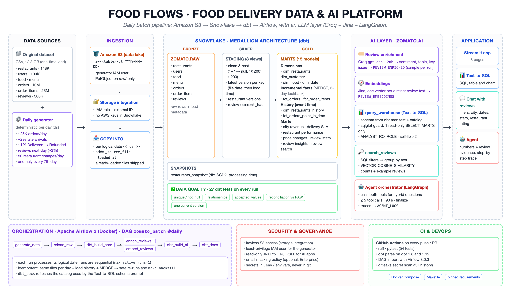

# Food Flows

[](https://github.com/macroni1407/food_flows/actions/workflows/ci.yml)

End-to-end batch data platform processing 10M+ orders, ~23M order items and 300K+ reviews, with new data generated every day: Amazon S3 → Snowflake → dbt → Airflow, plus an LLM layer (Groq + Jina + LangGraph) for review enrichment, review search, text-to-SQL and an Agent that combines both.

## Architecture

[](architecture.png)

## What gets built

| Layer | Where | What |
|---|---|---|
| Source | `data/` (local, not committed) | 4 dimension CSVs (restaurants ~148K, users 100K, food, menu) + 3 fact files: 10M orders, ~23M order items, 300K reviews |
| Daily input | `generator/` | A deterministic generator that writes one new day of restaurants, orders, order items and reviews |
| Lake | Amazon S3 | `raw/<table>/`, with daily data under `dt=YYYY-MM-DD/` partitions |
| Bronze | Snowflake `ZOMATO.RAW` | `COPY INTO` through a keyless storage integration, plus `_source_file` and `_loaded_at` |
| Silver | Snowflake `ZOMATO.STAGING` | dbt views: clean, type, rename, keep the latest version of each record |
| Gold | Snowflake `ZOMATO.MARTS` | Dimensions, incremental facts (MERGE), restaurant history, point-in-time facts and business marts |
| History | Snowflake `ZOMATO.SNAPSHOTS` | SCD2 snapshot of restaurants |
| AI | Snowflake `ZOMATO.AI` | LLM-enriched reviews, review embeddings, agent logs |
| Orchestration | Airflow 3 (Docker) | One daily DAG: generate → load → transform → enrich/embed → AI marts → docs |
| Apps | Streamlit | Text-to-SQL, chat with reviews, agent |

## Tech stack

Python · Pandas · Amazon S3 · AWS IAM · Snowflake · dbt (dbt-snowflake) · Apache Airflow 3 (Docker) · Groq (`openai/gpt-oss-120b`) · Jina AI embeddings · LangGraph · sqlglot · Streamlit · GitHub Actions

## Repository structure

```
├── generator/daily_generator.py   # deterministic daily data generator → S3
├── airflow/
│   ├── Dockerfile                 # Airflow 3 + Snowflake provider + Groq + boto3, dbt in its own venv
│   ├── docker-compose.yml         # postgres + api-server + scheduler + dag-processor
│   ├── .env.example               # template for airflow/.env
│   └── dags/zomato_batch.py       # the pipeline DAG (7 tasks)
├── zomato/                        # dbt project
│   ├── profiles.example.yml       # template for profiles.yml (credentials via env_var)
│   ├── models/staging/            # 8 staging views + sources + tests
│   ├── models/marts/              # 15 models: dims, facts, history, marts + docs and tests
│   ├── snapshots/                 # SCD2 snapshot of restaurants
│   ├── macros/                    # schema names, load metadata and dedup helpers
│   └── tests/                     # reconciliation and history tests
├── ai/
│   ├── agent/                     # shared code: Snowflake, LLM, embeddings, schema, SQL guard, tools, agent
│   ├── app.py                     # Streamlit app with 3 pages
│   ├── text_to_sql.py             # chat with the warehouse
│   ├── rag_chat.py                # chat with reviews
│   ├── agent_chat.py              # agent using both
│   ├── enrich_reviews.py          # LLM enrichment → ZOMATO.AI.REVIEW_ENRICHED
│   ├── embed_reviews.py           # embeddings → ZOMATO.AI.REVIEW_EMBEDDINGS
│   └── .env.example               # template for ai/.env
├── snowflake/                     # setup SQL 01–08, run in order in Snowsight
├── aws/iam/                       # IAM policies and trust policies
├── tests/                         # Python tests + DAG import check
├── Makefile                       # common commands (make help)
├── .github/workflows/ci.yml       # CI
└── requirements.txt               # Python dependencies (dbt + AI apps)
```

## How the pipeline works

### 1. Generate: daily data
`generator/daily_generator.py` writes one day of data to `s3://<BUCKET>/raw/<table>/dt=<day>/`: about 25K orders (+15% on weekends), ~2% of them arriving a day late, ~1% of delivered orders re-sent as refunds, reviews for ~3% of delivered orders, 50 restaurants changing price or rating, and a planted anomaly every 7th day (delivery delays or packaging complaints in one city). The output depends only on the date, so re-running a day gives the same files. It uploads with an IAM user that can only write under `raw/`.

### 2. Load: S3 → Snowflake
Snowflake reads the bucket through a storage integration and an IAM role, so no AWS keys are stored in Snowflake. `COPY INTO` loads the day's folders into `ZOMATO.RAW` and adds `_source_file` and `_loaded_at`. Snowflake skips files it has already loaded.

### 3. Transform: dbt
- **Staging:** one view per source. Parses the messy restaurant data (`--` → null, `₹ 200` → 200, `50+` → 50), normalises types and names, and keeps the latest version of each key (by file date, then load time), so refunds and restaurant changes replace older rows.
- **Dimensions:** `dim_restaurants`, `dim_customer` (with age segments), `dim_food`, `dim_date`.
- **Incremental facts:** `fct_orders` and `fct_order_items` use MERGE and filter on load time with a 3-day lookback, so late orders and status changes are picked up.
- **History:** `dim_restaurants_history` keeps every restaurant version by the date it changed; `fct_orders_point_in_time` joins each order to the price and rating in effect when it was placed. `restaurants_snapshot` is the dbt SCD2 snapshot.
- **Marts:** daily city revenue (GMV, AOV, cancel rate), restaurant performance, delivery SLA (p50/p90), price-change impact, daily review stats, review insights, and `mart_review_search` for review search.
- **Tests:** unique, not_null, relationships, accepted_values, plus reconciliation tests that compare the facts with RAW and a test that each restaurant has exactly one current version.

### 4. Orchestrate: Airflow
One daily DAG, `zomato_batch`:

```
generate_data → reload_raw → dbt_build_core → [enrich_reviews, embed_reviews] → dbt_build_ai → dbt_docs
```

Each run processes its logical date (`{{ ds }}`), runs are sequential (`max_active_runs=1`), and past days are filled with `make backfill`. Credentials are injected by docker-compose from `airflow/.env`.

### 5. AI layer
- **LLM enrichment** (`enrich_reviews.py`): asks Groq for structured JSON (sentiment, topic, key issue) for a sample of reviews per run (`SAMPLE_N`), skipping reviews already enriched.
- **Embeddings** (`embed_reviews.py`): embeds each distinct review text once with Jina.
- **Review search:** filters reviews in SQL (city, dates, stars, restaurant rating), groups them by text, ranks the texts by cosine similarity in Snowflake and returns each with its review count and example reviews. The LLM only fills in validated filter values.
- **Text-to-SQL:** the schema prompt is generated from dbt docs, with join keys and valid category values. Every query is checked by a `sqlglot` guard (one read-only SELECT on MARTS tables only), runs under the read-only `ANALYST_RO_ROLE`, and is corrected by the model if it fails.
- **Agent:** a LangGraph orchestrator that uses text-to-SQL and review search together (for example, numbers first, then reviews for the dates and city found), stops after 5 tool calls, and logs each run to `ZOMATO.AI.AGENT_LOGS`.

### 6. CI
GitHub Actions runs ruff, 54 Python tests (generator, SQL guard, agent loop, review search), `dbt parse` on dbt 1.8 and 1.12, a DAG import check with Airflow 3.0.3 and a gitleaks secret scan. `make ci` runs the same checks locally.

## Getting started

### Prerequisites
- Snowflake account, AWS account with an S3 bucket
- Docker (for Airflow), Python 3.10+
- Groq and Jina API keys
- The dataset CSVs placed in `data/` (not committed, ~2.3 GB)

### 1. Snowflake and AWS
Run `snowflake/01_setup.sql` → `08_masking_policy.sql` in order in Snowsight, using the JSON files in `aws/iam/` for the IAM policies and role. The order matters for the storage integration: create the IAM role → create the integration → `DESC INTEGRATION` → paste the Snowflake IAM user ARN and external ID into the role's trust policy. Do not re-run `CREATE OR REPLACE` on the integration afterwards: it regenerates the external ID and breaks the trust. `08_masking_policy.sql` is optional and needs Enterprise edition.

### 2. Python environment and config
```bash
python -m venv .venv && source .venv/bin/activate
make install
cp zomato/profiles.example.yml zomato/profiles.yml   # credentials are read from env vars
cp ai/.env.example ai/.env                            # SNOWFLAKE_*, GROQ_API_KEY, JINA_API_KEY
cp generator/.env.example generator/.env              # AWS key of the generator's IAM user, bucket
cp airflow/.env.example airflow/.env                  # SNOWFLAKE_*, GROQ_API_KEY, SAMPLE_N
```

### 3. Airflow
```bash
make build && make up                         # http://localhost:8080 (admin/admin)
make backfill FROM=2026-09-01 TO=2026-09-06   # one run per day
```
The containers mount `zomato/`, so `zomato/profiles.yml` from step 2 must exist.

### 4. AI apps
```bash
make embed    # embed review texts not embedded yet
make app      # Streamlit: Text-to-SQL, Chat with reviews, Agent
```
